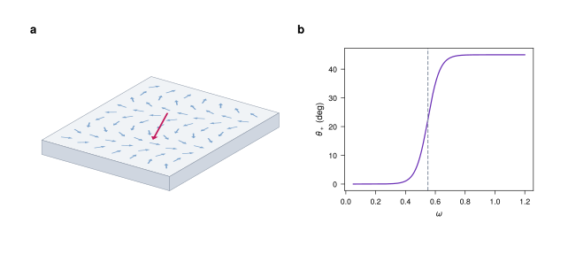

# FigWorks

FigWorks assembles multi-panel publication figures from Matplotlib plots, VecTeX
equations, VecView 3D scenes, VecWire circuit schematics, and native SVG
elements. The figure is generated from code and stays editable afterwards:
panels and elements keep stable ids, the same script writes byte-identical SVG,
and the result opens in Inkscape for final adjustments.

<p align="center">
  
</p>

<p align="center"><sub>A VecView 3D scene and a Matplotlib plot composed into one labelled figure, from <code>examples/vecview_panel.py</code>.</sub></p>

SVG is the canonical output; PDF and PNG are exported through CairoSVG.
FigWorks is an assembly layer between plotting code and the final graphic. It
does not replace Matplotlib, TeX, Inkscape, or Illustrator.

FigWorks is alpha: the core figure model works and is tested, but the API is
still settling and a minor release may change it.

## Install

FigWorks is not on PyPI yet. Install it from a checkout (Python 3.12 or newer):

```bash
python -m pip install -e /path/to/figworks
```

This pulls in Matplotlib, lxml, svg.py, CairoSVG, and VecTeX. Rendering
equations with VecTeX also needs a TeX installation with `pdflatex` and
`dvisvgm` on `PATH`. [VecView](https://github.com/maiani/vecview) and
[VecWire](https://github.com/maiani/vecwire) are optional. VecView is available
on PyPI; VecWire is installed from GitHub:

```bash
python -m pip install "vecview>=0.2"
python -m pip install "vecwire @ git+https://github.com/maiani/vecwire"
```

Figures are set in TeX Gyre Heros by default, a free Helvetica clone that comes
with TeX Live and as `fonts-texgyre` on Debian and Ubuntu. PDF and PNG export
check, through fontconfig, that every font a figure uses is installed and has
every glyph it needs, and raise `FontError` rather than substitute silently.

## Quick start

```python
import numpy as np
import matplotlib.pyplot as plt

from figworks import Figure

x = np.linspace(0, 2 * np.pi, 200)
mpl_fig, ax = plt.subplots(figsize=(3, 2))
(line,) = ax.plot(x, np.sin(x))
line.set_gid("sine-line")
ax.set_xlabel("x")
ax.set_ylabel("sin(x)")

fig = Figure(width="120mm", height="70mm", theme="paper")
panel = fig.panel("main", x="10mm", y="10mm", w="90mm", h="45mm")
panel.add(mpl_fig, id="sine-panel")

fig.label("a", anchor=panel.nw)
fig.text("A Matplotlib SVG panel", x="10mm", y="62mm", id="caption")
fig.arrow(id="caption-arrow", start=("45mm", "58mm"), end=("70mm", "40mm"))

fig.save("example.svg")
fig.save("example.pdf")
fig.save("example.png", dpi=300)
```

Coordinates and sizes accept `px`, `pt`, `mm`, `cm`, or `in`; bare numbers are
px. The artist id `sine-line` survives into `example.svg`, so
`fig.select("#sine-line")` and Inkscape both find it.

For the common case of dropping SVG into existing Matplotlib axes, `compose`
needs no `Figure` at all:

```python
import figworks
import matplotlib.pyplot as plt

fig, ax = plt.subplots()
ax.plot([0, 1], [0, 1])
svg = figworks.compose({ax: "logo.svg"}, fig=fig)
with open("figure.svg", "w", encoding="utf-8") as output:
    output.write(svg)
```

## What it does

The root package exports `Figure`, `Panel`, `Anchor`, `Theme`, `compose`,
`layout_svgs`, `display_svg`, and `FigureCollection`. With them you can:

- create an SVG canvas with physical dimensions and a theme (`"paper"` or
  `"presentation"`);
- add rectangular panels with named anchors (`panel.nw`, `panel.center`, …);
- place Matplotlib figures, VecTeX fragments, VecView scenes, VecWire circuits,
  SVG files, and SVG strings through one call, `Panel.add`;
- add native text, panel labels, rectangles, lines, circles, ellipses,
  polylines, paths, and arrows;
- reserve placeholders and fill them by id later;
- lay out many SVGs into a labelled grid;
- select elements by `#id`, `.class`, or tag name, then delete them or set
  attributes and inline style;
- save to `.svg`, `.pdf`, and `.png`, byte-identically from run to run, and
  display figures inline in notebooks;
- regenerate a whole set of figures from one command with `FigureCollection`.

`Panel.add` reads each source's intrinsic size from its `viewBox`, scales it
uniformly, and centres it in the panel. Placement wraps the source in a group
and keeps its ids, prefixing only those that collide with ids already in the
figure, so selectors reach inside placed content.

## Sources

Everything except Matplotlib integrates through one method: FigWorks places any
object exposing `to_svg_document()`. VecTeX, VecView, and VecWire implement it
without importing FigWorks, and FigWorks has no adapter for any of them.

### VecTeX equations

```python
import vectex

equation = vectex.render(r"\[E = mc^2\]", id_prefix="equation")
panel.add(equation, id="equation-panel")
fig.select("#equation-root").set_attr("color", "navy")  # VecTeX glyphs use currentColor
```

### VecView scenes

```python
import vecview

cam = vecview.OrthographicCamera(azim_deg=35, elev_deg=24, scale=62)
scene = vecview.Scene(cam, pad=6)
slab = vecview.box_faces(center=(0, 0, -0.45), size=(11, 9, 0.9))
scene.faces(10, slab, cull=True, fill="#cfd6e0")

panel.add(scene, id="slab-scene")
```

Leave the scene's `background` unset and keep `pad` small: the scene is scaled
to fit its panel, so padding shrinks the drawing.

A scene can also hold content of its own. `Scene.plane` reserves a rectangle of
a world plane and `Figure.fill_plane` puts a plot *in* it, foreshortened with
the geometry. `Scene.slot` pins an empty, upright group to a world point and
`Figure.fill_slot` fills it with content kept at its own physical size, so an
8 pt TeX label stays 8 pt however the scene was scaled:

```python
scene.plane(15, origin=(-4.2, -2.9, 0.01), u_edge=(0, 8.4, 0), v_edge=(5.8, 0, 0), id="plot-plane")

label = vectex.render(r"$\hat{z}$", size_pt=8)
scene.slot(45, (5.5, 4.5, 0), label.width_px, label.height_px, align="west", dx=1.6, id="label-z")

panel.add(scene, id="device")
fig.fill_plane("plot-plane", mpl_fig)
fig.fill_slot("label-z", label)
```

`fill_plane` normalizes content onto the unit square, so shape the plane to the
plot's aspect ratio. [3D scenes](docs/usage/scenes-3d.md) covers orientation,
line weights, and export caveats.

### VecWire circuits

A `vecwire.Circuit` places like any other source, and its component ids and
`data-component` attributes survive placement:

```python
right = fig.panel("schematic", x="120mm", y="8mm", w="40mm", h="56mm")
right.add(circuit, id="transmon-circuit")
fig.select("#JJ")  # a junction drawn with id="JJ"
```

### One style document per publication

```markdown
---
base: aps            # or nature, ieee, paper, presentation, another style.md
color:
  spin_up: "#d62828"
cycle: [spin_up]
---

# Style guide: what each colour means, which weight is for what ...
```

A `style.md` holds the publication's design tokens in its YAML frontmatter and
its style guide in prose. FigWorks generates Matplotlib settings from it
(`theme_rc("style.md")`), styles its own elements with it
(`Figure(..., theme="style.md")`), and builds figure sets under it
(`FigureCollection(style=...)`). Built-in bases follow the figure guidelines of
Nature, Physical Review, and IEEE. See [Styles](docs/usage/styles.md).

### Aligned Matplotlib panels

```python
panel = fig.panel("a", x="18mm", y="8mm", w="62mm", h="48mm")
mpl_fig, ax = panel.subplots()  # axes frame exactly the panel, at 1:1
ax.plot(x, y)
panel.add(mpl_fig, id="plot-a", fit="axes")
```

Plots made this way keep their nominal text size, and their axes frames sit
exactly on their panels, so frames in a row line up whatever their tick labels.

### Matplotlib, both directions

```python
from figworks.matplotlib import connect, insert, mpl_to_svg

svg = mpl_to_svg(mpl_fig)  # Matplotlib -> SVG
connect(ax, "slot", 0.2, 0.2, 0.6, 0.6)  # reserve a placeholder in the axes
result = insert({"slot": panel_fig}, fig=mpl_fig)  # swap in vector SVG by id
```

Matplotlib exports are made deterministic: FigWorks pins the id salt and drops
the export date, which otherwise change on every run.

## Placeholders and grids

Create named panels without calculating their coordinates:

```python
fig = Figure(width="180mm", height="110mm")
panels = fig.grid(
    [["device", "device"], ["spectrum", "response"]],
    width_ratios=(3, 2),
    height_ratios=(1, 2),
    margins=("8mm", "6mm", "12mm", "16mm"),  # top, right, bottom, left
    gap=("16mm", "22mm"),  # between rows, between columns
)
panels["device"].add(scene, id="device-scene")
mpl_fig, ax = panels["spectrum"].subplots()
ax.plot(x, y)
panels["spectrum"].add(mpl_fig, id="spectrum-plot", fit="axes")
fig.label("b", panels["spectrum"].nw)
```

Repeating a name spans a rectangle; `None` reserves an empty cell. Ratios
divide the space remaining after margins and gaps, which keep their physical
size when you build a figure at another width. The returned dictionary holds
ordinary `Panel` objects in first-occurrence order. See [Grid layout](docs/usage/layout.md)
and [the complete example](examples/panel_grid.py).

```python
fig.placeholder("main-slot", x="10mm", y="10mm", w="80mm", h="60mm", label="x")
fig.fill("main-slot", mpl_fig)  # a figure, an SVG file path, or an SVG string
```

```python
from figworks import layout_svgs

grid = layout_svgs([svg_a, svg_b, svg_c], labels=["a", "b", "c"], outline=True)
grid.save("grid.svg")
```

## Known limitations

A gradient-filled `<mask>` does not survive CairoSVG and vanishes from PDF and
PNG exports without a warning.

## Examples

Run from the repository root:

```bash
python examples/minimal_svg.py
python examples/matplotlib_panel.py
python examples/two_panel_figure.py
python examples/panel_grid.py
python examples/matplotlib_bridge.py
python examples/vecview_panel.py         # requires vecview
python examples/vecview_plane_plot.py    # requires vecview; a plot in a 3D plane
python examples/vecwire_panel.py         # requires vecwire
```

Each example writes its figures into `examples/out/`.

## The suite

FigWorks is the composition layer of four projects developed together, each
independently useful:

| Project | Produces | Maturity |
| --- | --- | --- |
| **FigWorks** | composed, exported multi-panel figures | alpha: core API still settling |
| [VecTeX](https://github.com/maiani/vectex) | editable TeX equations as SVG fragments | beta: on PyPI, API settled enough to build on |
| [VecView](https://github.com/maiani/vecview) | layered 3D schematics as SVG documents | alpha: on PyPI, API may change before 1.0 |
| [VecWire](https://github.com/maiani/vecwire) | editable circuit schematics as SVG documents | pre-alpha: first version, on GitHub, not yet on PyPI |

All four emit vector SVG with stable ids and byte-identical output for
identical input, so a figure can be regenerated from code, diffed in version
control, and still hand-tuned in Inkscape. All four are pre-1.0 and make no
backward-compatibility promise; deterministic output is the one guarantee they
share.

The dependency edges are uneven by design: VecTeX is a runtime requirement,
VecView and VecWire are optional, and none of the three depends on FigWorks.


## Development

```bash
python -m venv .venv
source .venv/bin/activate
python -m pip install -e ".[dev]"
ruff format --check .
ruff check .
ty check
pytest
```

Tests for VecView and VecWire skip when those packages are not installed.
Rendering tests need TeX Gyre Heros, DejaVu Sans, and fontconfig's command-line
tools (Debian/Ubuntu: `fonts-texgyre fonts-dejavu-core fontconfig`).

## Documentation

The docs in `docs/` are built with [Zensical](https://zensical.org):

```bash
zensical serve    # preview at http://localhost:8000
zensical build    # static build into site/
```


## License

MIT
